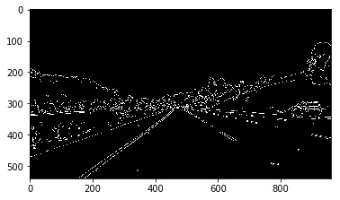
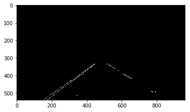

# **Finding Lane Lines on the Road** 
### by Daniel Prado-Rodriguez,  SDC Nanodegree
### February Cohort, 2/22/2017

---

## Finding Lane Lines on the Road - Introduction

The goals / steps of this project are the following:
* Make a pipeline that finds lane lines on the road from input images or video sequences.
* Describe and reflect on your work in this written report

[//]: # (Image References)

---

## Reflection

### 1. My Finding Lanes pipeline description

My pipeline consists of the following steps:

1. **Convert the input image to grayscale.**
Instead of using the suggested `COLOR_RGB2GRAY` conversion, I experimented with the HSI colorspace and finally I found out that it was more optimal to enhance the Yellow component of the image. **I did this by removing the Blue component, so my grayscale was `0.5*R+0.5*G.`**
You can note this slight advantage in the left yellow line with low contrast in the images below. The right one improves contrast by removing the blue component:

    

2. **Apply a Gaussian filter** to soften the image and avoid noise. I have used a kernel size of 5 that smooths noise and minimizes spurious edges, while keeping detail in tricky situations when there is not much contrast in the lines.

3. **Detect Edges using the Canny Edges algorithm**: this allows to detect the edges of the shapes contained in the image, including (but not only) the road lines. The parameters used have been a (low, high) threshold of values (40,80), that seems to provide a tradeoff between getting enough level of detail in tricky situations (optional challenge) and keeping not too much clutter.
Here is a sample resulting image:

    

4. **Mask the Region of Interest**: we apply a mask to the edges image to focus only on the area where the lane lines can be present, and setting the rest to black. The are chosen is a trapezoid polygon, with bottom vertices in the corners of the image and top vertices aproximately in the horizon of the road, 10% of the image width.

       

5. **Apply Hough Transform to find lines**: this allows to detect the lines in the edges image, using the provided helper function `hough_lines`. This function performs two steps:
   - Apply the transform to obtain a set of lines. The parameters used have been `threshold=40, min_line_len=30, max_line_gap=200`
   - Call the `draw_lines` method which analizes the detected lines, removes outliers, and averages the lines information to estimate the road lane lines position. **This is explained in more detail in the following section.**
Below you can see both steps, Hough Transform + Outlier Removal, and Average Line Estimated.

    ")
    
    
    
6. **Overlay the road lane lines over the original image** using the provided `weighted_img` function

       

### Draw Lines Improvements
A key aspect of this project was to develop an improved version of the `draw_lines` function that identifies the full extent of the lane and marks it clearly with a single, solid line over the left lane line, and a single, solid line over the right lane line. The lines should start from the bottom of the image and extend out to the top of the region of interest.
I managed to do this by the following steps:

1. For each line in the set of lines of the frame:
   
       * Calculate the central point of the line.
       * Calculate the slope of the line.
       * Determine if the line corresponds to the lane left-line or the right-line.
       * Discard outliers by filtering slope values and position of line in the image relative to its slope.
   
2. For the accepted lines:

       * Calculate the slope average weighted by its length.
       * Calculate the average central point

3. Finally:

       * Determine the x position of the final solid line at the top and the bottom of the region of interest, from the average central point and the average slope.
       * Draw the solid lines on the left side and right side of the lane.
   
---
### 2. Identify potential shortcomings with your current pipeline
My pipeline is well-enough fine-tuned to provide a very good result with the two sample videos.
It also works **reasonably well on the Optional Challenge video sequence**. This was the most tricky part of the project, because this sequence presents several difficulties, including:
* It's curved, not straight like the other videos.
* Changes in ilumination due to shadows.
* Changes in the color of the road asphalt.
* Irregularities, presence of debris, sand, patches and textures of the road asphalt.
* Very low contrast in grayscale between the asphalt and the yellow line.

I have addressed these issues using the following techniques:

Note that unlike suggested in the CarND Slack forums by several colleagues, **I have not used temporal information, averaged or applied a low-pass filter to lines between frames**.  I understand this would definitely exist in a real system, and would improve the _look_ of the final result. However in my opinion this masks shortcomings of the pipeline in tricky frames. In summary **I focused on optimizing the result on a frame-by-frame basis**, by fine-tuning the parameters and improving the `draw_lines` function.

In any case the proposed pipeline would present potential shortcomings in a number of situations:
* Eroded or old-painted lines.
* Blocking of lines by traffic.
* Illumination conditions, specially at dusk or night.
* Variable illumination.
* Lower radius curves.

---
### 3. Suggest possible improvements to your pipeline
* The current pipeline hardcodes the parameters of two critical functions, the Canny Edges detection and the Hough Transform. It is however very difficult to find parameters that suit well any situation. So, one proposal would be to make the thresholds adaptative to the image conditions. For example, when the contrast in the region of interest is very low.
* Another suggestion made by other colleagues is to apply a mask to retain only the image information with white or yellow pixels, darkening or setting to black the rest.
* Temporal averaging/low-pass filtering of the resulting lines, as commented in the previous section.
* Improve the outlier detection. For example, checking if all the line segments detected are roughly over the same line area, and discarding otherwise.

